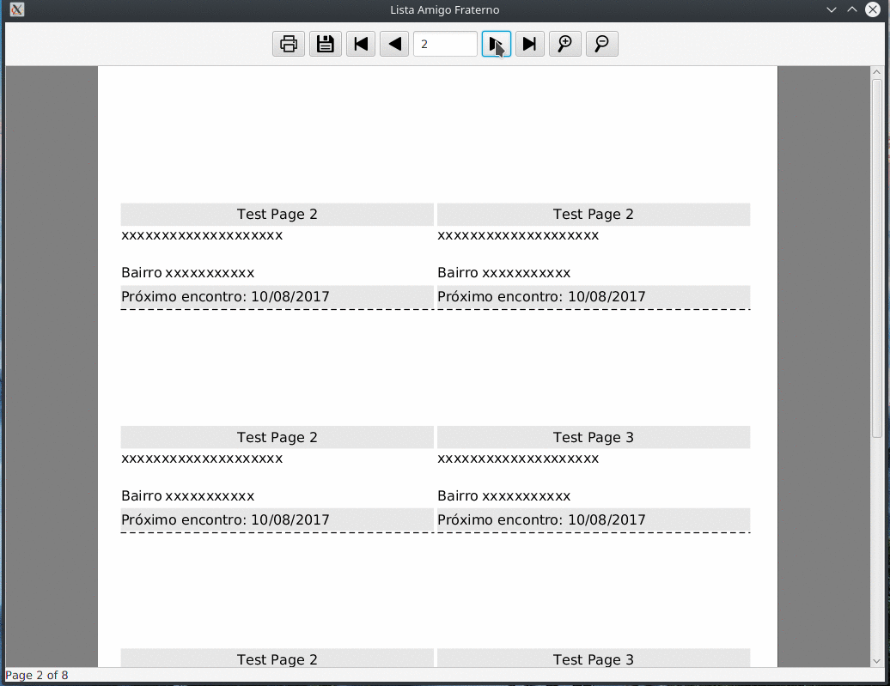

# JasperViewerFX

The JasperViewerFX is a free JavaFX library. Its goal is avoid usage of default Swing JasperReport's viewer and abstract the java code used to generate output formats.



# Features
- Exporting for PDF, HTML, XML (Without images), XLS, XLSX and CSV;
- Zoom in / Zoom Out;
- Minimalist interface completely writen in JavaFX;
- Abstract JasperReports code.

# Requirements
This library uses the following JasperReport's dependencies on JasperViewerFX.jar, but if you want to compile source yourself you can download [JasperReports](https://sourceforge.net/projects/jasperreports/files/jasperreports/) and build with ivy. 

- commons-beanutils-1.9.3.jar
- commons-collections-3.2.2.jar
- commons-digester-2.1.jar
- commons-javaflow-20160505.jar
- commons-logging-1.1.1.jar
- itext-2.1.7.js6.jar
- jasperreports-6.4.1.jar

# How to use

If you want to use an JDBC connection:
```java
JasperViewerFX viewer = new JasperViewerFX(stage, "Title", "relative path to .jasper", params, connection);
viewer.show();
```
If you want to use an java datasource:
```java
JasperViewerFX viewer = new JasperViewerFX(stage, "Title", "relative path to .jasper", params, JRBeanCollectionDataSource);
viewer.show();
```
