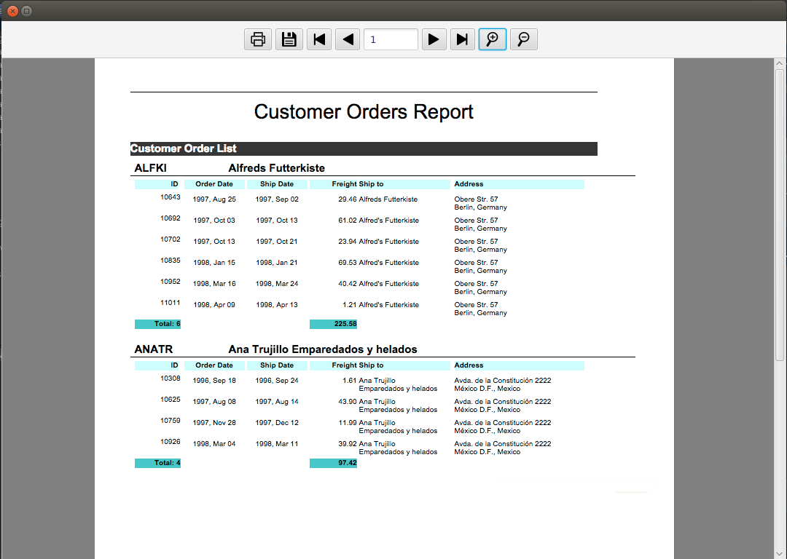

# JasperViewerFX

The JasperViewerFX is a free JavaFX library. Its goal is avoid usage of default Swing JasperReport's viewer and abstract the java code used to generate output formats.



# Features
- Exporting for PDF, HTML, XML (Without images), XLS, XLSX and CSV;
- Zoom in / Zoom Out;
- Minimalist interface completely writen in JavaFX;
- Fewer java code.

# Dependencies (JasperReports libs)
(Download: https://sourceforge.net/projects/jasperreports/files/jasperreports/)
- commons-beanutils-1.9.0.jar
- commons-collections-3.2.2.jar
- commons-digester-2.1.jar
- commons-javaflow-20160505.jar
- commons-logging-1.1.1.jar
- itext-2.1.7.js5.jar
- jasperreports-6.3.1.jar

# Usage

If you want to use an JDBC connection:
```java
JasperViewerFX viewer = new JasperViewerFX(stage, "Title", "relative path to .jasper", params, connection);
viewer.show();
```
If you want to use an java datasource:
```java
JasperViewerFX viewer = new JasperViewerFX(stage, "Title", "relative path to .jasper", params, JRBeanCollectionDataSource);
viewer.show();
```
