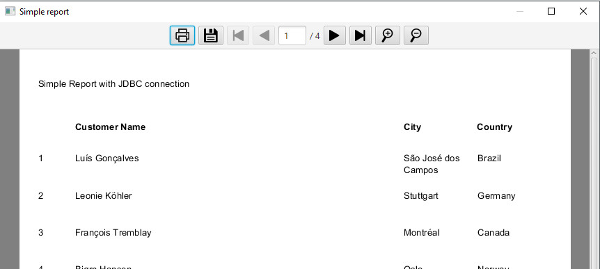

# JasperViewerFX

The JasperViewerFX aims to avoid usage of default Swing JasperReport's viewer. This viewer use SwingFXUtils to render only one page at time and append the output image to an ImageView.



# Limitations

JasperReports draw engine relies on awt graphics, drawing each element on a Graphics2D canvas. The JavaFX's GraphicsContext is incompatible with Graphics2D so, even translating the drawing methods, we have memory leaks in some situations. The ImageView method has better overall performance and doesn't cause memory problems, but prevent user to click links and the zoom quality decrease when scaling images.

# Features

- Exporting for PDF, HTML, XML (Without images), XLS, XLSX;
- Zoom in / Zoom Out;
- Interface completely written in JavaFX;
- Current page property.

# Dependencies
```
<dependencies>
	<dependency>
		<groupId>net.sf.jasperreports</groupId>
		<artifactId>jasperreports</artifactId>
		<version>6.13.0</version>
	</dependency>
</dependencies>
```

## Minimal Setup

- Tested with: jasperreports-6.0.0.jar (or above) and Java 8

# Older versions

In older versions of this project the JasperPrint's generation method has been abstracted. We decided to focus on just viewing the report and let the user decide how to generate it.

# How to use

## Example with JDBC connection

```java
try {
	Connection con = new ConnectionManager().getConnection();
	JasperReport jreport = (JasperReport) JRLoader.loadObject(getClass().getResource("your_resource_path"));
	JasperPrint jprint = JasperFillManager.fillReport(jreport, null, con);
	new JasperViewerFX(primaryStage).viewReport("Simple report", jprint);
	con.close();
} catch (JRException | SQLException e) {
	e.printStackTrace();
}
```

## Example with JRBeanCollectionDataSource

```java
try {
	JRBeanCollectionDataSource source = new JRBeanCollectionDataSource(collection);
	JasperReport jreport = (JasperReport) JRLoader.loadObject(getClass().getResource("your_resource_path"));
	JasperPrint jprint = JasperFillManager.fillReport(jreport, null, source);
	new JasperViewerFX().viewReport("JRBeanCollectionDataSource example", jprint);
} catch (JRException e) {
	e.printStackTrace();
}
```